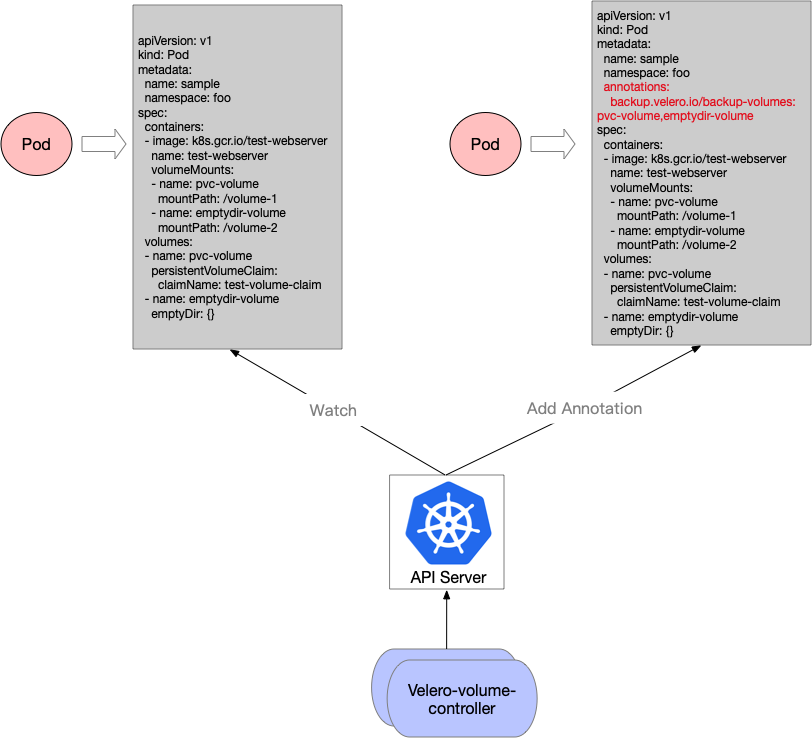

velero-volume-controller
========================

`velero-volume-controller` is a Kubernetes controller for [velero](https://github.com/vmware-tanzu/velero) that detects and adds relevant backup annotation to pods with [volumes](https://kubernetes.io/zh/docs/concepts/storage/volumes/)

## Overview

[velero](https://github.com/vmware-tanzu/velero) is one of the best `bur`(backup and restore) tools for workloads running on Kubernetes, and its [Restic Integration](https://velero.io/docs/v1.3.1/restic/) capability provides an out-of-the-box solution for backing up and restoring almost any type of Kubernetes volume*, so we can use Velero with Restic Integration to backup and restore Kubernetes applications and its relevant volumes data.

But one requirement of velero Restic Integration is that users have to add relevant backup annotation to pods, defining which pod volume(s) they want to back up, and in the meantime velero hasn't provided a do-one-command or automatic way to backup all volume resources in the cluster without annotations. Therefore, users have to add backup annotation for all pods with volumes in cluster by hand, which is complicated and unpractical in a production environment. 

To solve this, `velero-volume-controller` helps users to do this dull job automatically.     

## Precondition

* Velero's restic integration requires the Kubernetes [MountPropagation feature](https://kubernetes.io/docs/concepts/storage/volumes/#mount-propagation), which is enabled by default in Kubernetes v1.10.0 and later.

## Principle

The logic of `velero-volume-controller` is kept as simple as possible - watch pod `ADD|UPDATE` events and add relevant backup annotation to pods with volumes as below:



## Running

### External

velero-volume-controller can be run outside of the kubernetes as below:

```sh
$ bash hack/start.sh
```

### Internal

Running `velero-volume-controller` inside a kubernetes is more convenient compared with the external as this controller has added [Leader Election Mechanism](https://github.com/kubernetes/client-go/tree/master/examples/leader-election) and [Kubernetes deployment](https://kubernetes.io/docs/concepts/workloads/controllers/deployment/) helps to keep it high-available:

```sh
# Generated image
$ make dockerfiles.build
# Retag and push to your docker registry
$ docker tag duyanghao/velero-volume-controller:v2.0 xxx/duyanghao/velero-volume-controller:v2.0
$ docker push xxx/duyanghao/velero-volume-controller:v2.0
# Update the deployment 'Image' field with the built image name
$ sed -i 's|REPLACE_IMAGE|xxx/duyanghao/velero-volume-controller:v2.0|g' examples/deployment/velero-volume-controller.yaml
# Create ClusterRole and ClusterRoleBinding
$ kubectl apply -f examples/deployment/cluster-role.yaml
$ kubectl apply -f examples/deployment/cluster-role-binding.yaml
# Create ConfigMap
$ kubectl apply -f examples/deployment/configmap.yaml
# Create velero-volume-controller deployment
$ kubectl apply -f examples/deployment/velero-volume-controller.yaml
```

## Configuration

The following table lists the configurable parameters of the `velero-volume-controller` and the default values.

| Parameter                                                                   | Description                                                                                                                                                                                                                                                                                                                                     | Default                         |
| --------------------------------------------------------------------------- | ----------------------------------------------------------------------------------------------------------------------------------------------------------------------------------------------------------------------------------------------------------------------------------------------------------------------------------------------- | ------------------------------- |
| **ClusterServerCfg**                                                             |
| `clusterServerCfg.masterURL`                                                               | The address of the Kubernetes API server. Overrides any value in kubeconfig. Only required if out-of-cluster.                                                                                                                                                                                                                                                                         |                         |
| `clusterServerCfg.kubeConfig`                                                        | Path to a kubeconfig. Only required if out-of-cluster.                                                                                                                                                                                                                                                                                                                            |                           |
| `clusterServerCfg.leaseLockNamespace`                                                        | The Namespace of LeaseLock object for [controller Leader Election](https://github.com/kubernetes/client-go/tree/master/examples/leader-election).                                                                                                                                                                                                                                                                                                                            | `velero`                          |
| `clusterServerCfg.leaseLockName`                                                        | The Name of LeaseLock object for [controller Leader Election](https://github.com/kubernetes/client-go/tree/master/examples/leader-election).                                                                                                                                                                                                                                                                                                                            | `velero-volume-controller`                          |
| **veleroVolumeCfg**                                                             |
| `veleroVolumeCfg.includeNamespaces`                                                       | The comma-separated list of namespaces to include in the backup annotation addition (default: all namespaces).                                                                                                                                                                                                                                                                                                              |                           |
| `veleroVolumeCfg.excludeNamespaces`                                                       | The comma-separated list of namespaces to exclude from the backup annotation addition.                                                                                                                                                                                                                                                                                                        |                           |
| `veleroVolumeCfg.includeVolumeTypes`                                                       | The comma-separated list of [volume types](https://kubernetes.io/docs/concepts/storage/volumes/) to include in the backup annotation addition(default: all volume types).                                                                                                                                                                                                                                                                                                        | `persistentVolumeClaim`                          |
| `veleroVolumeCfg.excludeVolumeTypes`                                                       | The comma-separated list of [volume types](https://kubernetes.io/docs/concepts/storage/volumes/) to exclude from the backup annotation addition.                                                                                                                                                                                                                                                                                                        |                           |

## Roadmap

`velero-volume-controller` will follow upstream [vmware-tanzu/velero](https://github.com/vmware-tanzu/velero) support for [Restic Integration](https://velero.io/docs/v1.3.1/restic/). 

## Refs

* [Restic Integration](https://velero.io/docs/v1.3.1/restic/)
* [velero-pvc-watcher](https://github.com/bitsbeats/velero-pvc-watcher)
* [velero backup Kubernetes Persistent Volume failed with minio](https://github.com/vmware-tanzu/velero/issues/2355)
* [sample-controller](https://github.com/kubernetes/sample-controller)
* [Leader Election Example](https://github.com/kubernetes/client-go/tree/master/examples/leader-election)
* [Add 3rd party controller to build an automatic way to backup all volume resources in the cluster](https://github.com/vmware-tanzu/velero/issues/2375)
